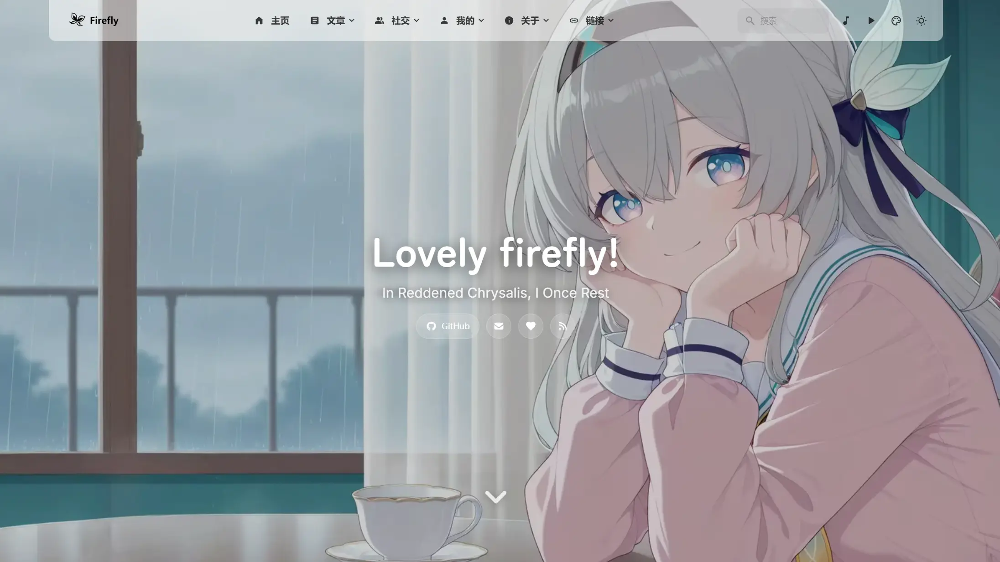
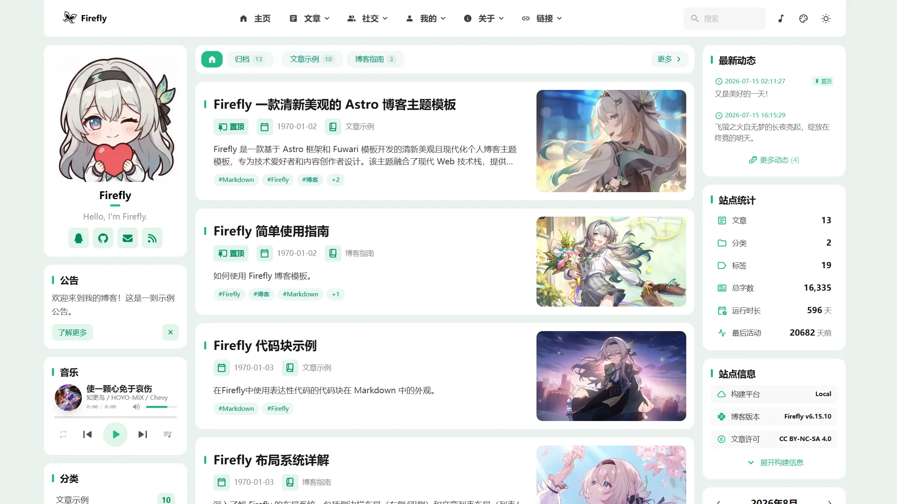
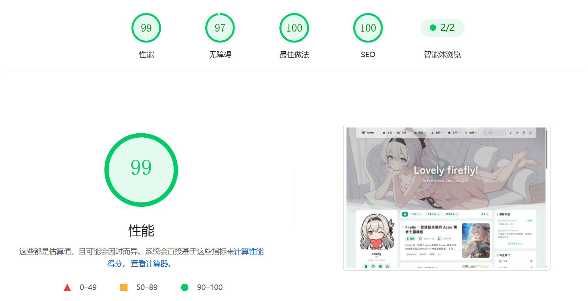

> 你好！ 我是 **𝘚𝘩𝘪𝘮𝘮𝘦𝘳𝘧𝘭𝘺 · 星沫** ，一点在数字世界中默默无闻的星光。

</head><body>

<a href="/about/" class="extiw" title="𝘚𝘩𝘪𝘮𝘮𝘦𝘳𝘧𝘭𝘺 · 星沫">𝘚𝘩𝘪𝘮𝘮𝘦𝘳𝘧𝘭𝘺 · 星沫</a>

<!-- 这里是放置你 3D 角色图片的地方，把 src 替换成你的图片路径即可 -->
<table class="table-wrap"><tbody><tr><td class="label">正版ID</td><td class="value">𝚂𝚑𝚒𝚖𝚖𝚎𝚛𝚏𝚕𝚢_𝟸𝟹𝟹[仅 <a href="https://zh.minecraft.wiki/w/Java%E7%89%88" title=" Java 版">Java 版</a>] 🌈 𝚁𝚊𝚒𝚗𝚋𝚘𝚠𝟺𝟻𝟹𝟼 🌈[仅<a href="https://zh.minecraft.wiki/w/%E5%9F%BA%E5%B2%A9%E7%89%88" title="基岩版">基岩版</a>]</td></tr><tr><td class="label">真实姓名</td><td class="value">[Permission Denied]</td></tr><tr><td class="label">所在地</td><td class="value">中国杭州</td></tr><tr><td class="label">类型</td><td class="value">友好生物</td></tr><tr><td class="label">生命值</td><td class="value">114514 (❤ × 57257)</td></tr><tr><td class="label">攻击力</td><td class="value">-1 (❤)</td></tr></td></tr></tbody></table>

## 关于我的 XP · About my XP

已单独成篇至[此处](/posts/About-JH-XP)

## UserBox · 用户框

### 国籍及语言

&nbsp<a href="/about/" class="extiw" title="𝘚𝘩𝘪𝘮𝘮𝘦𝘳𝘧𝘭𝘺 · 星沫">𝘚𝘩𝘪𝘮𝘮𝘦𝘳𝘧𝘭𝘺 · 星沫</a> 来自中国，你好！

&nbsp<a href="/about/" class="extiw" title="𝘚𝘩𝘪𝘮𝘮𝘦𝘳𝘧𝘭𝘺 · 星沫">𝘚𝘩𝘪𝘮𝘮𝘦𝘳𝘧𝘭𝘺 · 星沫</a>&nbsp的母语是<a href="https://zh.wikipedia.org/wiki/%E6%B1%89%E8%AF%AD" class="extiw" title="wzh:汉语">汉语</a>

### 又菜又爱玩

&nbsp<a href="/about/" class="extiw" title="𝘚𝘩𝘪𝘮𝘮𝘦𝘳𝘧𝘭𝘺 · 星沫">𝘚𝘩𝘪𝘮𝘮𝘦𝘳𝘧𝘭𝘺 · 星沫</a>&nbsp正在原 __ __ 动！

&nbsp<a href="/about/" class="extiw" title="𝘚𝘩𝘪𝘮𝘮𝘦𝘳𝘧𝘭𝘺 · 星沫">𝘚𝘩𝘪𝘮𝘮𝘦𝘳𝘧𝘭𝘺 · 星沫</a>&nbsp是一名 Minecrafter

&nbsp<a href="/about/" class="extiw" title="𝘚𝘩𝘪𝘮𝘮𝘦𝘳𝘧𝘭𝘺 · 星沫">𝘚𝘩𝘪𝘮𝘮𝘦𝘳𝘧𝘭𝘺 · 星沫</a>&nbsp这家伙的 Minecraft Java 版用户名是 𝚂𝚑𝚒𝚖𝚖𝚎𝚛𝚏𝚕𝚢_𝟸𝟹𝟹[仅<a href="https://zh.minecraft.wiki/w/Java%E7%89%88" title=" Java 版">&nbspJava 版</a>]

&nbsp<a href="/about/" class="extiw" title="𝘚𝘩𝘪𝘮𝘮𝘦𝘳𝘧𝘭𝘺 · 星沫">𝘚𝘩𝘪𝘮𝘮𝘦𝘳𝘧𝘭𝘺 · 星沫</a>&nbsp这家伙的 Minecraft(基岩版) 用户名是 🌈 𝚁𝚊𝚒𝚗𝚋𝚘𝚠𝟺𝟻𝟹𝟼 🌈[仅<a href="https://zh.minecraft.wiki/w/%E5%9F%BA%E5%B2%A9%E7%89%88" title="基岩版">基岩版</a>]

<b>拒绝网易</b>

&nbsp<a href="/about/" class="extiw" title="𝘚𝘩𝘪𝘮𝘮𝘦𝘳𝘧𝘭𝘺 · 星沫">𝘚𝘩𝘪𝘮𝘮𝘦𝘳𝘧𝘭𝘺 · 星沫</a>&nbsp非常不喜欢网易版，因为他认为网易版是魔改！

<b>不玩基岩</b>

&nbsp<a href="/about/" class="extiw" title="𝘚𝘩𝘪𝘮𝘮𝘦𝘳𝘧𝘭𝘺 · 星沫">𝘚𝘩𝘪𝘮𝘮𝘦𝘳𝘧𝘭𝘺 · 星沫</a>&nbsp不喜欢玩基岩版

&nbsp<a href="/about/" class="extiw" title="𝘚𝘩𝘪𝘮𝘮𝘦𝘳𝘧𝘭𝘺 · 星沫">𝘚𝘩𝘪𝘮𝘮𝘦𝘳𝘧𝘭𝘺 · 星沫</a>&nbsp已经不玩基岩版了

&nbsp<a href="/about/" class="extiw" title="𝘚𝘩𝘪𝘮𝘮𝘦𝘳𝘧𝘭𝘺 · 星沫">𝘚𝘩𝘪𝘮𝘮𝘦𝘳𝘧𝘭𝘺 · 星沫</a>&nbsp喜欢玩火！

&nbsp<a href="/about/" class="extiw" title="𝘚𝘩𝘪𝘮𝘮𝘦𝘳𝘧𝘭𝘺 · 星沫">𝘚𝘩𝘪𝘮𝘮𝘦𝘳𝘧𝘭𝘺 · 星沫</a>&nbsp喜爱上锁的箱子！

<b>/命令</b>

&nbsp<a href="/about/" class="extiw" title="𝘚𝘩𝘪𝘮𝘮𝘦𝘳𝘧𝘭𝘺 · 星沫">𝘚𝘩𝘪𝘮𝘮𝘦𝘳𝘧𝘭𝘺 · 星沫</a>&nbsp喜欢使用命令！

&nbsp<a href="/about/" class="extiw" title="𝘚𝘩𝘪𝘮𝘮𝘦𝘳𝘧𝘭𝘺 · 星沫">𝘚𝘩𝘪𝘮𝘮𝘦𝘳𝘧𝘭𝘺 · 星沫</a>&nbsp爱玩&nbsp<a target="_blank" rel="nofollow noreferrer noopener" class="external text" href="http://terraria.wiki.gg">Terraria</a>

### 社交的手腕

&nbsp<a href="http://space.bilibili.com/581938829" class="extiw" title="𝘚𝘩𝘪𝘮𝘮𝘦𝘳𝘧𝘭𝘺 · 星沫 的小破站主页">𝘚𝘩𝘪𝘮𝘮𝘦𝘳𝘧𝘭𝘺 · 星沫</a>&nbsp也在 <a target="_blank" rel="nofollow noreferrer noopener" class="external text" title="小破站主页" href="http://bilibili.com/">小破站</a> 上活跃

&nbsp<a href="http://x.com/Shimmerfly_233" class="extiw" title="𝘚𝘩𝘪𝘮𝘮𝘦𝘳𝘧𝘭𝘺 · 星沫 的 𝕏 主页">𝘚𝘩𝘪𝘮𝘮𝘦𝘳𝘧𝘭𝘺 · 星沫</a>&nbsp也在 <a target="_blank" rel="nofollow noreferrer noopener" class="external text" title="𝕏 主页" href="http://x.com">𝕏</a> 上活跃

<svg data-component="Octicon" aria-hidden="true" focusable="false" class="octicon octicon-mark-github" viewBox="0 0 24 24" width="44" height="44" fill="currentColor" display="inline-block" overflow="visible" style="vertical-align:text-bottom"><path d="M10.226 17.284c-2.965-.36-5.054-2.493-5.054-5.256 0-1.123.404-2.336 1.078-3.144-.292-.741-.247-2.314.09-2.965.898-.112 2.111.36 2.83 1.01.853-.269 1.752-.404 2.853-.404 1.1 0 1.999.135 2.807.382.696-.629 1.932-1.1 2.83-.988.315.606.36 2.179.067 2.942.72.854 1.101 2 1.101 3.167 0 2.763-2.089 4.852-5.098 5.234.763.494 1.28 1.572 1.28 2.807v2.336c0 .674.561 1.056 1.235.786 4.066-1.55 7.255-5.615 7.255-10.646C23.5 6.188 18.334 1 11.978 1 5.62 1 .5 6.188.5 12.545c0 4.986 3.167 9.12 7.435 10.669.606.225 1.19-.18 1.19-.786V20.63a2.9 2.9 0 0 1-1.078.224c-1.483 0-2.359-.808-2.987-2.313-.247-.607-.517-.966-1.034-1.033-.27-.023-.359-.135-.359-.27 0-.27.45-.471.898-.471.652 0 1.213.404 1.797 1.235.45.651.921.943 1.483.943.561 0 .92-.202 1.437-.719.382-.381.674-.718.944-.943"></path></svg>

&nbsp<a href="https://github.com/Shimmerfly" class="extiw" title="𝘚𝘩𝘪𝘮𝘮𝘦𝘳𝘧𝘭𝘺 · 星沫 的 Github 页面">𝘚𝘩𝘪𝘮𝘮𝘦𝘳𝘧𝘭𝘺 · 星沫</a>&nbspis on&nbsp<a target="_blank" rel="nofollow noreferrer noopener" class="external text" title="Github 主页" href="https://github.com/unknown">GitHub</a>

&nbsp<a href="https://www.coolapk.com/u/40199391" class="extiw" title="𝘚𝘩𝘪𝘮𝘮𝘦𝘳𝘧𝘭𝘺 · 星沫">𝘚𝘩𝘪𝘮𝘮𝘦𝘳𝘧𝘭𝘺 · 星沫</a>&nbsp也在<a href="https://www.coolapk.com/" class="extiw" title="酷安主页">酷安</a>上活跃 用户名为&nbsp<a href="https://www.coolapk.com/u/40199391" class="extiw" title="𝘚𝘩𝘪𝘮𝘮𝘦𝘳𝘧𝘭𝘺 · 星沫 的酷安主页">Shimmerfly</a>

### 泰克孬罗技

&nbsp<a href="/about/" class="extiw" title="𝘚𝘩𝘪𝘮𝘮𝘦𝘳𝘧𝘭𝘺 · 星沫">𝘚𝘩𝘪𝘮𝘮𝘦𝘳𝘧𝘭𝘺 · 星沫</a>&nbsp喜欢使用 <a href="https://zh.wikipedia.org/wiki/Mozilla_Firefox" class="extiw" title="wzh:Mozilla Firefox">Firefox</a>&nbsp浏览器

&nbsp<a href="/about/" class="extiw" title="𝘚𝘩𝘪𝘮𝘮𝘦𝘳𝘧𝘭𝘺 · 星沫">𝘚𝘩𝘪𝘮𝘮𝘦𝘳𝘧𝘭𝘺 · 星沫</a>&nbsp喜欢使用&nbsp<a href="https://zh.wikipedia.org/wiki/%E4%B8%AA%E4%BA%BA%E7%94%B5%E8%84%91" class="extiw" title="wzh:个人电脑">个人电脑</a>

&nbsp<a href="/about/" class="extiw" title="𝘚𝘩𝘪𝘮𝘮𝘦𝘳𝘧𝘭𝘺 · 星沫">𝘚𝘩𝘪𝘮𝘮𝘦𝘳𝘧𝘭𝘺 · 星沫</a>&nbsp喜欢使用&nbsp<a href="https://zh.wikipedia.org/wiki/%E9%BA%A6%E9%87%91%E5%A1%94" class="extiw" title="wzh:麦金塔">Mac&nbsp电脑</a>

&nbsp<a href="/about/" class="extiw" title="𝘚𝘩𝘪𝘮𝘮𝘦𝘳𝘧𝘭𝘺 · 星沫">𝘚𝘩𝘪𝘮𝘮𝘦𝘳𝘧𝘭𝘺 · 星沫</a>&nbsp喜欢使用&nbsp<a href="https://zh.wikipedia.org/wiki/Linux" class="extiw" title="wzh:Linux">Linux</a>&nbsp系统

&nbsp<a href="/about/" class="extiw" title="𝘚𝘩𝘪𝘮𝘮𝘦𝘳𝘧𝘭𝘺 · 星沫">𝘚𝘩𝘪𝘮𝘮𝘦𝘳𝘧𝘭𝘺 · 星沫</a>&nbsp喜欢使用&nbsp<a href="https://zh.wikipedia.org/wiki/macOS" class="extiw" title="wzh:macOS">macOS</a>&nbsp系统

&nbsp<a href="/about/" class="extiw" title="𝘚𝘩𝘪𝘮𝘮𝘦𝘳𝘧𝘭𝘺 · 星沫">𝘚𝘩𝘪𝘮𝘮𝘦𝘳𝘧𝘭𝘺 · 星沫</a>&nbsp喜欢使用&nbsp<a href="https://zh.wikipedia.org/wiki/Mac_OS_X" class="extiw" title="wzh:Mac OS X">OS&nbspX</a>&nbsp系统

&nbsp<a href="/about/" class="extiw" title="𝘚𝘩𝘪𝘮𝘮𝘦𝘳𝘧𝘭𝘺 · 星沫">𝘚𝘩𝘪𝘮𝘮𝘦𝘳𝘧𝘭𝘺 · 星沫</a>&nbsp喜欢使用原生&nbsp<a href="https://space.bilibili.com/691415738" class="extiw" title="wzh:Android">Android</a>&nbsp系统

&nbsp<a href="/about/" class="extiw" title="𝘚𝘩𝘪𝘮𝘮𝘦𝘳𝘧𝘭𝘺 · 星沫">𝘚𝘩𝘪𝘮𝘮𝘦𝘳𝘧𝘭𝘺 · 星沫</a>&nbsp的手机搭载了 Google 的原生&nbsp<a href="https://zh.wikipedia.org/wiki/Android" class="extiw" title="wzh:Android">Android</a>&nbsp系统

&nbsp<a href="/about/" class="extiw" title="𝘚𝘩𝘪𝘮𝘮𝘦𝘳𝘧𝘭𝘺 · 星沫">𝘚𝘩𝘪𝘮𝘮𝘦𝘳𝘧𝘭𝘺 · 星沫</a>&nbsp正在使用&nbsp<a href="https://zh.wikipedia.org/wiki/Visual_Studio_Code" class="extiw" title="wzh:Visual Studio Code">Visual Studio Code</a>

### 小破站关注

&nbsp<a href="/about/" class="extiw" title="𝘚𝘩𝘪𝘮𝘮𝘦𝘳𝘧𝘭𝘺 · 星沫">𝘚𝘩𝘪𝘮𝘮𝘦𝘳𝘧𝘭𝘺 · 星沫</a>&nbsp喜欢看&nbsp<a href="https://zh.wikipedia.org/wiki/Android" class="extiw" title="苏打 baka 的小破站主页">苏达达</a>&nbsp的视频

&nbsp<a href="/about/" class="extiw" title="𝘚𝘩𝘪𝘮𝘮𝘦𝘳𝘧𝘭𝘺 · 星沫">𝘚𝘩𝘪𝘮𝘮𝘦𝘳𝘧𝘭𝘺 · 星沫</a>&nbsp喜欢看&nbsp<a href="https://zh.wikipedia.org/wiki/Google_Chrome" class="extiw" title="nor 叔小破站主页">nor 叔</a>&nbsp的视频

### 其他

&nbsp<a href="/about/" class="extiw" title="𝘚𝘩𝘪𝘮𝘮𝘦𝘳𝘧𝘭𝘺 · 星沫">𝘚𝘩𝘪𝘮𝘮𝘦𝘳𝘧𝘭𝘺 · 星沫</a>&nbsp在编辑时擅长丢档! 其实刚刚就丢了一次档😅

&nbsp<a href="/about/" class="extiw" title="𝘚𝘩𝘪𝘮𝘮𝘦𝘳𝘧𝘭𝘺 · 星沫">𝘚𝘩𝘪𝘮𝘮𝘦𝘳𝘧𝘭𝘺 · 星沫</a>&nbsp正在学校读书 此用户会有一段时间不在

&nbsp<a href="/about/" class="extiw" title="𝘚𝘩𝘪𝘮𝘮𝘦𝘳𝘧𝘭𝘺 · 星沫">𝘚𝘩𝘪𝘮𝘮𝘦𝘳𝘧𝘭𝘺 · 星沫</a>&nbsp该用户正在学习高中知识

&nbsp<a href="/about/" class="extiw" title="𝘚𝘩𝘪𝘮𝘮𝘦𝘳𝘧𝘭𝘺 · 星沫">𝘚𝘩𝘪𝘮𝘮𝘦𝘳𝘧𝘭𝘺 · 星沫</a>&nbsp讨厌数学！

&nbsp<a href="/about/" class="extiw" title="𝘚𝘩𝘪𝘮𝘮𝘦𝘳𝘧𝘭𝘺 · 星沫">𝘚𝘩𝘪𝘮𝘮𝘦𝘳𝘧𝘭𝘺 · 星沫</a>&nbsp喜欢往用户框里塞用户框

## 豪丸の🀀🀂

<iframe src="/public/dagou-tap/index.html" title="大狗 Tap 互动壁纸" width="100%" height="640" style="border:none;border-radius:16px;background:#fff2dc;" allow="autoplay" loading="lazy"></iframe>

**[全屏打开](/public/dagou-tap/index.html)**

-----

> 感谢你的来访！希望在这里能找到对你有用的内容！

-----

# 上游 README

## 流萤 / Firefly 
> 一款清新美观的 Astro 静态博客主题模板
> 
>  

>
> 

> 
> 
>
> **QQ交流群：[1087127207]()**
> 
> 

---
📖 README：
**[简体中文](README.md)** | **[繁體中文](docs/README.zh-TW.md)** | **[English](README.en.md)** | **[日本語](docs/README.ja.md)** | **[한국어](docs/README.ko.md)**

🚀 快速指南：
[**🖥️在线预览**](https://firefly.cuteleaf.cn/) /
[**📝使用文档**](https://docs-firefly.cuteleaf.cn/) /
[**🍀我的博客**](https://blog.cuteleaf.cn) 

⚡ 静态站点生成: 基于 Astro 的超快加载速度和 SEO 优化

🎨 现代化设计: 简洁美观的界面，支持自定义主题色

📱 移动友好: 完美的响应式体验，移动端专项优化

🔧 高度可配置: 大部分功能模块均可通过配置文件自定义

<table width="100%" align="center">
  <tr>
    <td colspan="3" align="center">
      
       横幅模式</td>
    </td>
  </tr>
  <tr>
    <td align="center"> 透明覆盖模式</td>
    <td align="center"> 全屏壁纸模式</td>
    <td align="center"> 纯色模式</td>
  </tr>
</table>

>[!TIP]
>
>Firefly 是一款基于 Astro 框架和 Fuwari 模板开发的清新美观且现代化个人博客主题模板，专为技术爱好者和内容创作者设计。该主题融合了现代 Web 技术栈，提供了丰富的功能模块和高度可定制的界面，让您能够轻松打造出专业且美观的个人博客网站。
>
>**如果你参考或使用了 Firefly 的组件设计和相关代码，请注明来自 Firefly。**
>
>Firefly 也保留了原版 fuwari 的布局，可根据自己的喜好在配置文件中自由切换。
>
>**更多布局配置及演示请查看：[Firefly 布局系统详解](https://firefly.cuteleaf.cn/posts/guide/firefly-layout-system/)**
>
>Firefly 支持 i18n 多语言 UI，但除了简体中文，其他语言均为 AI 翻译转换，如有错误，欢迎提交 [Pull Request](https://github.com/CuteLeaf/Firefly/pulls) 修正。

### ✨ 功能特性

#### 核心功能

- [x] **Astro + Tailwind CSS** - 基于现代技术栈的超快静态站点生成
- [x] **流畅动画** - Swup 页面过渡动画，提供丝滑的浏览体验
- [x] **响应式设计** - 完美适配桌面端、平板和移动设备
- [x] **多语言支持** - i18n 国际化，UI 支持简体中文、繁体中文、英文、日文、俄语、韩文
- [x] **全文搜索** - 基于 Pagefind 的客户端搜索，支持文章内容索引

#### 个性化
- [x] **动态侧边栏** - 支持配置单侧边栏、双侧边栏
- [x] **文章布局** - 支持配置(单列)列表、网格(多列/瀑布流)布局
- [x] **字体管理** - 支持自定义字体，丰富的字体选择器
- [x] **页脚配置** - HTML 内容注入，完全自定义
- [x] **亮暗色模式** - 支持亮色/暗色/跟随系统三种模式
- [x] **导航栏自定义** - Logo、标题、链接全面自定义
- [x] **壁纸模式切换** - 横幅壁纸、全屏壁纸、全屏透明壁纸、纯色背景
- [x] **主题色自定义** - 360° 色相调节

如果你有好用的功能和优化，请提交 [Pull Request](https://github.com/CuteLeaf/Firefly/pulls)

### 🙏 致谢

非常感谢 [saicaca](https://github.com/saicaca) 开发的 [fuwari](https://github.com/saicaca/fuwari) 模板，Firefly 就是基于这个模板二次开发

流萤部分相关图片素材版权归游戏 [《崩坏：星穹铁道》](https://sr.mihoyo.com/) 开发商 [米哈游](https://www.mihoyo.com/) 所有

#### 技术栈

- [Astro](https://astro.build) 
- [Tailwind CSS](https://tailwindcss.com) 
- [Iconify](https://iconify.design)

#### 灵感项目

- [fuwari](https://github.com/saicaca/fuwari)
- [hexo-theme-shoka](https://github.com/amehime/hexo-theme-shoka)
- [astro-koharu](https://github.com/cosZone/astro-koharu)
- [Mizuki](https://github.com/matsuzaka-yuki/Mizuki)

#### 其他参考
- 博主`霞葉`的 [Bangumi 收藏](https://kasuha.com/posts/fuwari-enhance-ep2/) 页面组件
- 哔哩哔哩up主 `公公的日常` 的Q版 [流萤看板娘 Spine 切片数据](https://www.bilibili.com/video/BV1fuVzzdE5y) 

### 📝 许可协议

本项目遵循 [MIT license](https://mit-license.org/) 开源协议，详细查看 [LICENSE](./LICENSE) 文件

最初 Fork 自 [saicaca/fuwari](https://github.com/saicaca/fuwari)，感谢原作者的贡献

**版权声明：**
- Copyright (c) 2024 [saicaca](https://github.com/saicaca) - [fuwari](https://github.com/saicaca/fuwari)
- Copyright (c) 2025 [CuteLeaf](https://github.com/CuteLeaf) - [Firefly](https://github.com/CuteLeaf/Firefly) 

根据 MIT 开源协议，你可以自由使用、修改、分发代码，但需保留上述版权声明。

### 🍀 贡献者

感谢以下贡献者对本项目做出的贡献，如有问题或建议，请提交 [Issue](https://github.com/CuteLeaf/Firefly/issues) 或 [Pull Request](https://github.com/CuteLeaf/Firefly/pulls)。

><a href="https://github.com/CuteLeaf/Firefly/graphs/contributors">
>  
></a>

感谢以下贡献者对原项目 [fuwari](https://github.com/saicaca/fuwari) 做出的贡献，为本项目奠定了基础。

><a href="https://github.com/saicaca/fuwari/graphs/contributors">
>  
></a>

### ⭐ Star History

<!-- ALL-CONTRIBUTORS-LIST:START - Do not remove or modify this section -->
<!-- prettier-ignore-start -->
<!-- markdownlint-disable -->

<!-- markdownlint-restore -->
<!-- prettier-ignore-end -->

<!-- ALL-CONTRIBUTORS-LIST:END -->
